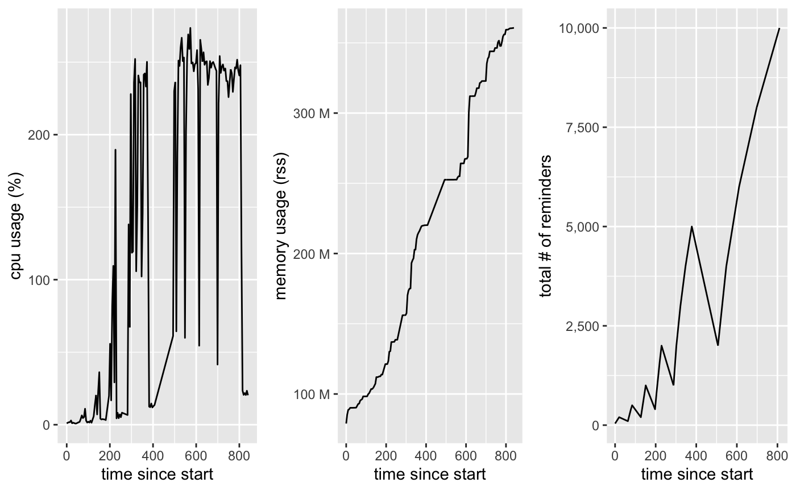
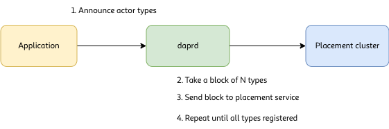
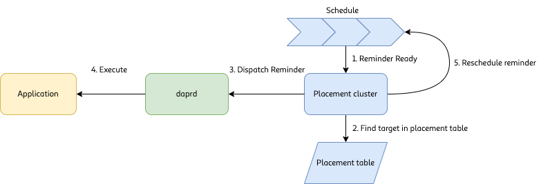

### What does this propose?

This proposal suggests that we make some structural changes to the actor system in Dapr in order to improve performance and increase observability. In particular, this proposal focuses on the reminder and timer storage and dispatch model and the gRPC communication between daprd and the placement service as well as metrics to be added for improved observation, performance monitoring and diagnosis. 

#### Increase observability of the actor system 

This work requires the implementation of a metrics registry (see [[Metrics Registry]]), however, assuming that exists, the actor system will add new metrics to Dapr: 

Daprd: 
* Actor invocations (counters and timers) tagged with actor type and where they were invoked (possibly even ID?)
* Placement data interactions
	* Lock metrics (timers / counters)
	* Queries (hits and misses, timers)
	* Misses
	* Table sync operations
	* Table update operations (i.e actor type registration)

Placement service
* Table information
	* Number of actors types registered (gauge)
	* Number of current actors being placed (gauge)
	* Update metrics (timer)
	* Dissemination metrics (timers, counters)
* Reminder / timer information
	* Active reminders (gauges per time bucket)
	* Reminder dispatch performance (timers)
* Raft activity 
	* Synchronization metrics (timers)
	* Operation counts 
	* Health data

#### Move reminder storage and dispatch to placement service

Rather than have daprd manage reminder partitioning and storage, we should leverage the placement service's ability to do consistent hashing for placement / execution of reminders as well. This would allow for a more even distribution of reminders as well as flexible execution / scheduling of reminders if the number of sidecars grow and shrink. It also reduces the burden of `daprd` to manage reminder scheduling and will provide a single control mechanism for dispatching reminders to actor nodes. 

### Why do we need this?

As it stands there are performance-related issues that make it challenging to employ a large number of actor types or a large quantity of reminders. Currently, the time it takes to register new reminders increases with the number of reminders already in the system. 

Below we have a chart that shows a correlation between the number of reminders that have been registered and the CPU and memory resources required of `daprd`. 

The right-most plot shows the total number of reminders that have been registered over time, while the left-most plot shows the % of CPU used by the `daprd` process and the middle plot shows the memory consumed by `daprd`. 

The process for testing the system was as follows:

1. Register N reminders, with a due-date and period such that they will fire twice to avoid registering reminders while executing them constantly, using the Go SDK 
2. Record memory and CPU usage by sampling the resources used by the `daprd` process in the process table
3. Allow some reasonable amount of time after creating the total number of reminders for collecting data
4. Programmatically remove the reminders that were created. 
5. Repeat with a larger value of N

This process was then repeated for increasing numbers of N, the values of which are the peaks of the line plot on the right (i.e 100, 500, 1K, 2K, 5K, 10K).

The end result is that creating more than a few hundred reminders quickly begins to consume large amounts of CPU time, as well as increases the amount of time it takes to register new reminders (as is shown by the increasing spacing along the X axis for each peak / trough on the right).

Additionally, testing shows that communication between `daprd` and the placement service begins to fail if an application registers more than 600 types of workers. 

As such, operating a large number of actors (in quantity) or registering large quantities of reminders proves to be problematic in the current implementation. 

#### Why now?

As a new feature in Dapr, we are going to be implementing a workflow engine that will rely heavily on actor subsytem to provide a significant amount of functionality that is required to implement workflows. Implementing a workflow engine requires that Dapr be capable of scheduling and dispatching potentially thousands of reminders concurrently, in addition each workflow will likely have many different types of actions that they take, each of which would be modeled as an actor, and as such it is entirely possible that a system having even only dozens of workflows could exceed the current limit of ~600 different actor types (imagine 30 different workflows with 20 different steps each, for example) quite quickly. 

In addition, a workflow engine will need to have a good level of visibility into its activity. Users (and / or operators) will need to be able to observe how many workflows are being executed, where they are running, what their state is, who is participating in the workflows, etc. Which will require being able to expose more information about the placement of actors, their throughput, and so on. 

Therefore, in order to implement a workflow engine that can scale with the needs of users, the actor subsystem will need to be able to handle the level of work that is required to make this happen. 

### How will this work?

(For simplicity, Reminders and Timers are treated as the same here because they are effectively identical from the perspective of the placement service)

#### Placement service changes

Placement service will now be responsible for three new pieces of functionality: Reminder scheduling (i.e knowing what reminders or timer need to fire when), reminder storage and reminder dispatching. 

##### Scheduling 

Using a time-base bucketing system (https://github.com/johnewart/go-timescheduler), the leader in the placement cluster will keep track of all the reminders that are scheduled across the `daprd` nodes that are connected to it. This has the advantage of being performant (time is divided into N + 1 buckets, the +1 being "everything past the last bucket") by decreasing the amount of data that is being evaluated, as well as easy to bulk load from storage with O(n) cost to rebuild the structure. 

Internally, each placement service will keep synchronized copies of the timer and reminder data in the same way it stores the actor placement data but only the leader will keep track of the scheduling data. The scheduling data is only needed by the primary and if / when a new node takes over from the existing leader, it can quickly reconstruct the schedule itself from the persisted data. 

##### Storage

The placement service will persist and synchronize the timer and reminder data in a similar fashion to the way it manages and stores placement data. Currently this is done using BoltDB but the actual storage mechanism itself is not as critical as the synchronization / dissemination data. The data that will now be stored in addition to placement data will include timer and reminder raw data (actor, schedule, etc.) that is required to reconstruct the scheduling data in the event of a failover or recovery. 

##### Dispatching

Each placement service will maintain a dispatching thread that is responsible for:
* Evaluating the schedule for any timers / reminders that need to fire
* Determining which actor node will receive a given dispatch (using existing placement data or creating it if none exists) 
* Issuing gRPC commands to the target node for the dispatch of the event
* Handling rescheduling of the event in question for future execution
* Recording metrics regarding timing and counts

#### daprd changes

##### Reminder / timer registration and dispatch 

With this new structure, `daprd` would be responsible solely for execution of reminders and timers, similar to how it handles actor invocations, not for scheduling or storage / partitioning of reminder and timer data. In order for this to happen, the control channel used to communicate with placement service will need to have a new message type for invoking the reminder or timer and accompanying logic to handle those messages. 

###### Actor registration

Currently, `daprd` sends all of the known actor types at once to the placement service; this results in a loss of communication channels when the number of distinct actor types reaches a threshold around 600 or so. The net result is that (currently) the gRPC messages are too large and it tries to re-send them but continually fails. The change here will be to perform the actor registration in smaller chunks in order to avoid messages that are too large. 

### Flow Diagram

#### Actor Registration

#### Reminder Registration

#### Reminder Execution

### Measurement of success

The goal of this change is to improve the performance of actor dispatch and registration by moving it away from daprd and into placement service. In order to ensure that we have not only improved performance  but also kept existing functionality we will need to have tests that prove both of these things. 

The goal for reminder registration is to be able to register new reminders in consistent time (i.e adding new reminders should not increase in duration proportionally to the number of reminder already registered). A reasonable target should be registering a new reminder or timer should take <= 10msec consistently, regardless of the number of currently registered reminders or timers. 

Timer execution needs to happen in a timely fashion; reminders and timers should fire as close to their scheduled time as possible and there should be little drift as the number of registered timers or reminders grows. For any scheduled event, dispatch time (i.e the time at which the message fires from the placement service) should happen within a maximum of 50msec of its scheduled time with little change as the number of reminders increases. In addition, the time to dispatch the event should happen in under 10msec. 

In addition, the application should be able to expose many different types of actors without crashing the system. While it is perhaps unreasonable to expect that an application would export millions of actor types, it is reasonable to expect that it should be able to export at least several thousand without causing the system to fail. As a rough estimate, an application should be able to register at least 20,000 types of actors without causing an issue (but we should discover where the upper bound is, if there is one)

##### TL;DR
* Reminder / timer registration should target <= 10msec consistently, regardless of number of existing reminders or timers
* Timer dispatch should be within 50msec of scheduled time
* Dispatch message should be delivered to `daprd` in < 10msec over gRPC
* Applications should be capable of registering at least 20,000 different types of actors

### What needs to be done

- [ ] Code changes
        - [ ] Add metrics (to measure current behavior and performance as a baseline)
	- [ ] Create new gRPC messages for placement service dispatch commands
	- [ ] Add timer / reminder registration to placement service
	- [ ] Add persistence / dissemination of reminder data to placement service cluster
	- [ ] Add scheduling and dispatch engine to placement service
	- [ ] Change daprd to forward registrations to placement cluster
	- [ ] Add migration code to move existing reminder / timers to placement service
	- [ ] Add dispatch handling to `daprd`
	- [ ] Change `daprd` to send registered actors to placement service in blocks instead of all-at-once
- [ ] Test changes
	- [ ] Additional performance tests for reminder registration and execution
	- [ ] E2E tests ensuring that placement service properly handles execution of reminders 
	- [ ] Double-activation guard tests 
- [ ] Documentation changes
	- [ ] Outline where reminders and timers are stored / how they are handled
